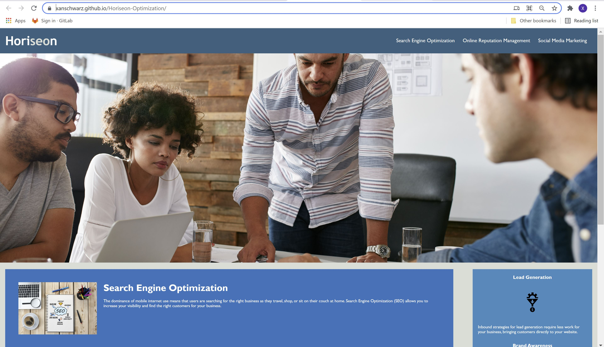
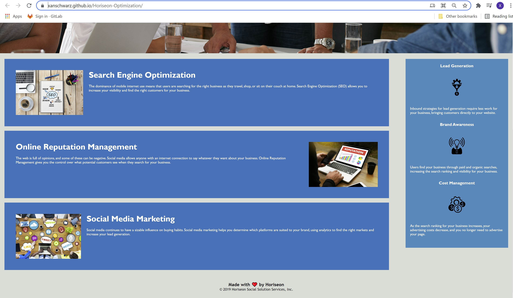

# Horiseon-Optimization
This repository contains the assignment to optimize the Horiseon landing page for accessiblity as well as search engine results.

An index html file and css style page were provided. The html file was updated to incorporate semantic tags, a descriptive title, alt attributes for accessibility on images, comments throughout, and properly functioning links.

The css file was updated to reflect the changes to semantic html and incorporate comments throughout. Additionally superfluous property definitions were omitted and consolidation was carried out to avoid repeating property definitions at deeper levels when they could be defined at a more general level to apply to the same elements.

Below are screenshots of the application.

This is a link of the deployed application: https://xanschwarz.github.io/Horiseon-Optimization/
